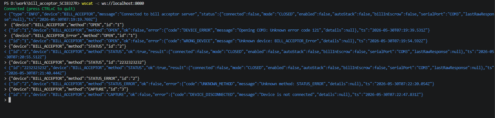
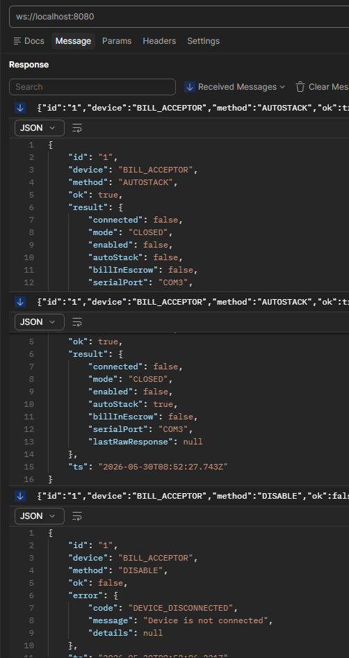
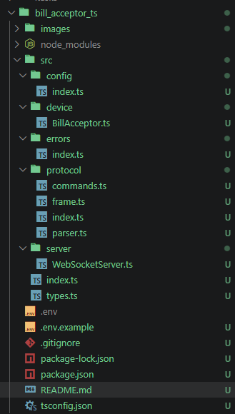

# bill-acceptor-ts

Node.js/TypeScript server that connects an MEI SCL8327R bill acceptor to a WebSocket API. It polls the device over RS232 using the EBDS protocol and lets you control it with JSON over WebSocket. 


## Setup

Install dependences 

```
npm install
```

Change `.env.example` into `.env`. Open `.env` and set `SERIAL_PORT` to your port. On Windows, check Device Manager under "Ports (COM & LPT)". On Linux it's usually `/dev/ttyUSB0` or `/dev/ttyACM0` and so on.

If you're testing from a browser or Postman on the same machine and you're on Windows, also set `WS_HOST=0.0.0.0`. The default `localhost` resolves to IPv6 (::1) on Windows, so any IPv4 client gets ECONNREFUSED. 

```
npm run dev        
npm run typecheck  
```
If you need to build and run project follow:
```
npm run build      
npm start         
```


## Connecting

By using wscat:

```
npm install -g wscat
wscat -c ws://localhost:8080
```




By using Postman:
The request: 
```json
{"device":"BILL_ACCEPTOR","method":"AUTOSTACK","id":"1","params":{"enabled":false}}
{"device":"BILL_ACCEPTOR","method":"AUTOSTACK","id":"1","params":{"enabled":true}}
{"device":"BILL_ACCEPTOR","method":"DISABLE","id":"1"}
```
Responce:



Available methods:

- `OPEN` opens the serial port and verifies the device responds
- `CLOSE` closes the port and stops the polling loop
- `STATUS` returns current state; works whether connected or not
- `CAPTURE` starts accepting bills
- `ENABLE` same as CAPTURE
- `DISABLE` stops accepting bills
- `STACK` takes the bill waiting in escrow and stores it in the cash box
- `RETURN` sends the escrowed bill back out
- `AUTOSTACK` takes `params: {"enabled": true/false}` and auto-stacks every bill without waiting for a command

`STACK` and `RETURN` only work when a bill is actually in escrow. You get `NO_ESCROW` otherwise.


## Project layout




## Config

All settings in `.env`. All have defaults so the server starts without one.

| Variable | Default | Notes |
|---|---|---|
| `SERIAL_PORT` | `COM3` | change this to your port |
| `SERIAL_BAUD_RATE` | `9600` | EBDS spec, leave it |
| `SERIAL_PARITY` | `even` | required by EBDS, leave it |
| `WS_HOST` | `localhost` | set `0.0.0.0` on Windows |
| `WS_PORT` | `8080` | |
| `SERIAL_TIMEOUT_MS` | `1500` | how long to wait for a device response |
| `POLL_INTERVAL_MS` | `200` | polling frequency in ms |

## Additional information from Google:
### How EBDS polling works

The acceptor doesn't push notifications. The server sends a STATUS frame (command byte 0x10) every 200ms and reads the response. If a bill gets inserted, the state change shows up in the next poll response. You send STACK (0x41) or RETURN (0x42) the same way.

Every frame starts with STX (0x02), then a LENGTH byte (total frame size), then the command/data bytes, and ends with a BCC checksum, which is the XOR of all bytes from LENGTH through the last data byte. The ACK bit in the frame header alternates 0/1 with each successful exchange, so the device can detect if you resent a frame.

The server handles all of this internally. You just send JSON.


### General Frame Anatomy

Every standard EBDS message is structured as follows:

| Field | Hex Value / Type | Description |
| :--- | :--- | :--- |
| **STX** | `0x02` | Start of text/frame marker. |
| **LENGTH** | `number` | Total number of bytes in the entire frame. |
| **CMD / MSG_TYPE** | `byte` | Command or message type byte (includes ACK toggle bit). |
| **DATA** | `bytes[]` | Optional payload bytes (e.g., currency enable masks). |
| **ETX** | `0x03` | End of text/frame marker. |
| **CHK** | `byte` | Checksum. Calculated via bitwise **XOR** of all bytes between STX and CHK (from `LENGTH` through `ETX`). |

---

### Device Response Frame Layout (Standard 11-Byte Buffer)

When decoding raw data streams from the bill acceptor, the device typically replies with an 11-byte frame (`LENGTH = 0x0B`). The system parses this buffer index by index:


| Index | Field Name | Description |
| :---: | :--- | :--- |
| **`[0]`** | `STX` | Start of frame (`0x02`) |
| **`[1]`** | `LENGTH` | Total frame size (`0x0B`) |
| **`[2]`** | `MSG_TYPE` | Message routing identifier |
| **`[3]`** | `DEV_TYPE` | Device classification code |
| **`[4]`** | `DOC_TYPE` | Denomination code (e.g., `0` = no bill, `5` = \$5, etc.) |
| **`[5]`** | `STATUS_0` | **Bill movement flags** (Bitmask) |
| **`[6]`** | `STATUS_1` | **Hardware error flags** (Bitmask) |
| **`[7]`** | `STATUS_2` | Reserved for future firmware flags |
| **`[8]`** | `STATUS_3` | Reserved for future firmware flags |
| **`[9]`** | `ETX` | End of frame (`0x03`) |
| **`[10]`**| `CHK` | Block Check Character (XOR Checksum) |

---

### Bitmask Diagnostic Maps

Because statuses are sent as bitmasks, you must check individual bits to determine the state of the machine or the bill.

#### `STATUS_0`: Bill Movement States
* **Bit 0 (`0x01`):** Idling
* **Bit 1 (`0x02`):** Accepting
* **Bit 2 (`0x04`):** Escrowed
* **Bit 3 (`0x08`):** Stacking
* **Bit 4 (`0x10`):** Stacked
* **Bit 5 (`0x20`):** Returning
* **Bit 6 (`0x40`):** Returned
* **Bit 7 (`0x80`):** Rejected

#### `STATUS_1`: Hardware Error States
* **Bit 2 (`0x04`):** Jammed
* **Bit 3 (`0x08`):** Cassette Full
* **Bit 4 (`0x10`):** Cassette Removed